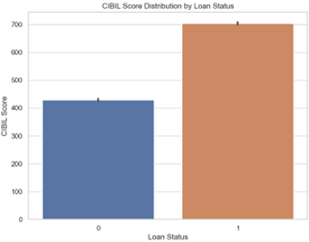
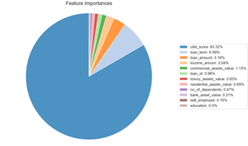
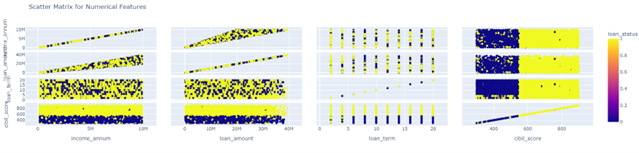

# Project 4: Machine Learning Solutions for Optimizing loan application approvals.

### Overview:
Traditionally, loan approval decisions in financial institutions have been made through manual evaluation processes that rely on subjective criteria. This approach often leads to inconsistent outcomes and an increased risk of loan defaults. By harnessing the power of machine learning, we can revolutionize the loan approval process, making it more efficient, objective, and data-driven.
The primary objective of this project is to develop a robust machine learning model capable of accurately predicting loan approval decisions. By leveraging historical loan application data, the model will identify intricate patterns and relationships, enabling it to determine whether a loan should be approved or rejected.
Automating the loan approval process through machine learning techniques offers numerous advantages. It streamlines decision-making, eliminating the need for time-consuming manual evaluations. Additionally, the model's data-driven approach ensures consistent and objective decisions, minimizing the risk of human bias or errors.
Ultimately, the successful implementation of this project will empower financial institutions to make informed loan approval decisions swiftly and accurately. This, in turn, will mitigate the risk of defaults, enhance profitability, and foster a more efficient and reliable lending ecosystem.

### Instructions:
To begin the data analysis process, essential Python modules such as pandas, numpy, matplotlib, seaborn, and scikit-learn are imported. The loan approval dataset is then read into a Pandas Data Frame, and data preprocessing steps are applied, including renaming columns and converting 'loan status' to binary values (1 for 'Approved', 0 �Rejected�). The dataset is further explored by analysing approved loans and calculating the correlation matrix to understand feature relationships. Model development is undertaken, incorporating algorithms like Logistic Regression, Gradient Boosting, Decision Tree Classifier, and Random Forest to predict loan approval decisions based on dataset features. Finally, high accurate/selected models are optimized, and significant factors affecting loan approval are analysed.

### Data Sources:
Dataset  Source :  https://www.kaggle.com/datasets/architsharma01/loan-approval-prediction-dataset
Complete Machine Learning Guide to Parameter Tuning in Gradient Boosting (GBM) in Python : Gradient Boosting | Hyperparameter Tuning Python (analyticsvidhya.com)
Code References: loan_approval.ipynb
Visualizations:
Note: Please download the Jupiter notebook to view plotly graphs.
Our project features a range of visualizations, including but not limited to:
* Bar chart -showing relationship between Loan status and CIBIL Score 

* Pie chart -Top 10 feature importances of a Loan approval decision

* Scatter matrix for numerical features � Visualization of how the loan status relates to the numerical features 

### Conclusion:
Overall, Project 4 aimed to utilize machine learning techniques to enhance the efficiency and accuracy of loan application approvals, ultimately contributing to better decision-making processes in the financial domain.

It's important to note that for each financial institution, the protocols and parameters for evaluating model performance and setting thresholds for metrics like precision, recall, and F1-score may differ. This variability can stem from several factors including the institution's risk tolerance, regulatory requirements, target customer demographics, and historical data patterns.

For instance, a conservative financial institution may prioritize precision over recall to minimize the risk of approving loans to potentially risky applicants, thus setting a higher threshold for precision. On the other hand, a fintech startup aiming for rapid growth might prioritize recall to capture as many potential customers as possible, even if it means accepting a higher risk of default, thus setting a higher threshold for recall.

Moreover, regulatory bodies may impose specific requirements on financial institutions regarding the minimum acceptable performance metrics for loan approval models. These regulations could influence the thresholds set by each institution for precision, recall, and F1-score.

Additionally, the distribution of classes in the dataset, as indicated by the support values, may vary for different financial institutions based on their customer base and loan portfolio. Therefore, the interpretation and optimization of these metrics should be tailored to the specific context and objectives of each institution.

In summary, while precision, recall, and F1-score provide valuable insights into model performance, their interpretation and importance may vary across financial institutions based on their unique business objectives, risk appetite, regulatory environment, and customer demographics.

